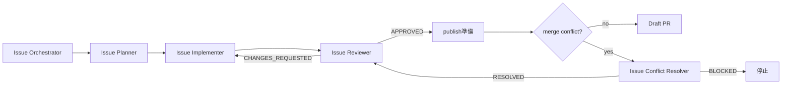

# Issue Agent Skills

GitHub Issue の要件整理から実装・レビュー・Draft PR 作成までを、役割分担して進める AI 開発用 Skill 集です。

## 構成

```text
.agents/skills/
  issue-requirements-interviewer/  # 要件整理と Issue 作成
  issue-orchestrator/              # 1件の Issue 実装を進行
  issue-planner/                   # 実装計画
  issue-implementer/               # 実装とテスト
  issue-conflict-resolver/         # 実際に発生した merge conflict の解消
  issue-reviewer/                  # 読み取り専用レビュー
  issue-agent-bootstrap/           # 導入環境の診断・初期化・検証
```

## 前提ツール

| 項目 | 要否 | 用途・条件 |
| --- | --- | --- |
| Codex | 必須 | Issue Agent Skills の実行 |
| Git | 必須 | 差分、branch、commit、push の管理 |
| GitHub CLI (`gh`) | Issue 実装フローで必須 | Issue・ラベルの操作と Draft PR 作成。事前に認証が必要 |
| Herdr | 任意 | Agent ごとの pane 分離。不在時は Codex サブエージェントを使用 |
| `HERDR_ENV=1` | Herdr 利用時のみ必須 | Herdr 管理 pane 内であることの判定 |

## Bootstrap

Issue Agent Skillsを新しいリポジトリへ導入するとき、または実行環境を再診断するときは`$issue-agent-bootstrap`を使用します。

Bootstrapは次の順序で実行します。応答の最初の非空行は、`OUTCOME: READY`、`OUTCOME: INITIALIZED`、`OUTCOME: VERIFIED`、`OUTCOME: BLOCKED`のいずれかです。警告、診断結果、変更内容、検証リソースは以降をMarkdownで報告します。

1. `doctor`: Codex、Git、GitHub CLI、GitHub認証、repository・worktree、実効権限、必須ラベルを読み取り専用で診断する。Herdr、`HERDR_ENV=1`、`herdr --help`、`herdr agent --help`、`herdr pane --help`も確認する。
2. `initialize`: 変更予定を先に表示し、明示的な実行依頼がある場合だけ、7つの`status:*`・`priority:*`ラベルを合意済みの色と説明へ冪等に収束させる。対象外ラベルは変更しない。
3. 再診断: 初期化後の状態を読み取り専用で確認する。
4. `verify`（通常）: 読み取り専用で再診断、Skill契約、validator、差分を検証する。
5. `verify`（live）: 明示的な要求に加え、run ID付きテストIssue・Draft PR・branch、GitHub書き込み、成功時・失敗時の後片付け方針を承認した場合だけ、実際のIssueとDraft PRを使って検証する。

Herdrと`HERDR_ENV=1`は任意の推奨項目です。利用できない場合は`WARNING`を表示し、Issue OrchestratorはCodexサブエージェントへフォールバックします。必須ツール、GitHub認証、repository・worktree、実効権限、必須ラベルが不足している場合は`BLOCKED`として停止します。

グローバル設定または権限設定の診断エラーを検知した場合、Bootstrapは永続状態を変更せず停止します。明示的な承認後もBootstrap自身は修正せず、安全な次の操作を案内します。通常の`verify`は読み取り専用です。live verifyは明示的な要求と、run ID付きのテストIssue、Draft PR、branch、GitHub書き込み、成功時・失敗時の後片付け方針への明示的承認後にだけ実行します。`$issue-orchestrator`を呼び出してOutcome、ラベル遷移、manifest、commit・push、Draft PRのbase/head/bodyを検査し、mergeは行いません。失敗証跡は既定で保持します。

## 使い方

要件を整理して Issue を作成するときは `$issue-requirements-interviewer`、作成済みの1件の Issue を計画・実装・レビュー・Draft PR 作成まで進めるときは `$issue-orchestrator` を使用します。個別の Planner、Implementer、Conflict Resolver、Reviewer は Orchestrator から呼び出す前提です。

## 要件整理

`issue-requirements-interviewer` は、既存文書・コード・Issue・PR を調査し、利用者へのヒアリングを通じて合意した実装単位を GitHub Issue にします。実装、PR 作成、レビュー、マージは行いません。

## Issue 実装フロー

単一Issueの状態、証跡、停止、再開、CI完了条件は[`docs/loop-engineering.md`](docs/loop-engineering.md)を設計上の正とします。公開可能な実行状態、安全な要約、opaque checkpointは対象GitHub Issueへ保存し、完全な成果物、fingerprint、manifest、生path、unsalted Git blob ID、検証用秘密は権限制限された永続保存先へ分離します。

`issue-orchestrator` は1件の GitHub Issue を受け取り、3つの通常Roleと、実際のmerge conflict時だけConflict Resolverを呼び出します。



- Planner は関連コードとテストを読み、実装計画だけを作成します。
- Implementer は計画に沿って実装とテストを行います。
- Conflict Resolver はGitが実際に生成した競合だけを対象に、競合元PR・Issue・commit履歴から意図を調査し、競合ファイルを解消します。
- Reviewer は変更を編集せず、Issue の完了条件、差分、テスト結果を独立して確認します。
- Reviewer が変更を要求した場合は、同じ Implementer が修正し、同じ Reviewer が再レビューします。
- Reviewer が承認した変更だけを Orchestrator が commit・push し、GitHub CLI で Draft PR を作成します。

Orchestrator は Herdr を利用できる場合、各役を専用 pane で実行します。利用できない場合は Codex サブエージェントへフォールバックします。

## 役割別モデル

| Skill | モデル | reasoning effort |
| --- | --- | --- |
| Issue Requirements Interviewer | `gpt-5.6-sol` | `medium` |
| Issue Orchestrator | `gpt-5.6-sol` | `medium` |
| Issue Planner | `gpt-5.6-terra` | `medium` |
| Issue Implementer | `gpt-5.6-terra` | `medium` |
| Issue Conflict Resolver | `gpt-5.6-sol` | `high` |
| Issue Reviewer | `gpt-5.6-sol` | `high` |

Requirements Interviewer と Orchestrator の設定は、直接呼び出す際の推奨値です。Orchestrator は Planner、Implementer、Conflict Resolver、Reviewer を表の設定で起動し、指定モデルを利用できない場合は別モデルへ自動で切り替えず `BLOCKED` として報告します。
