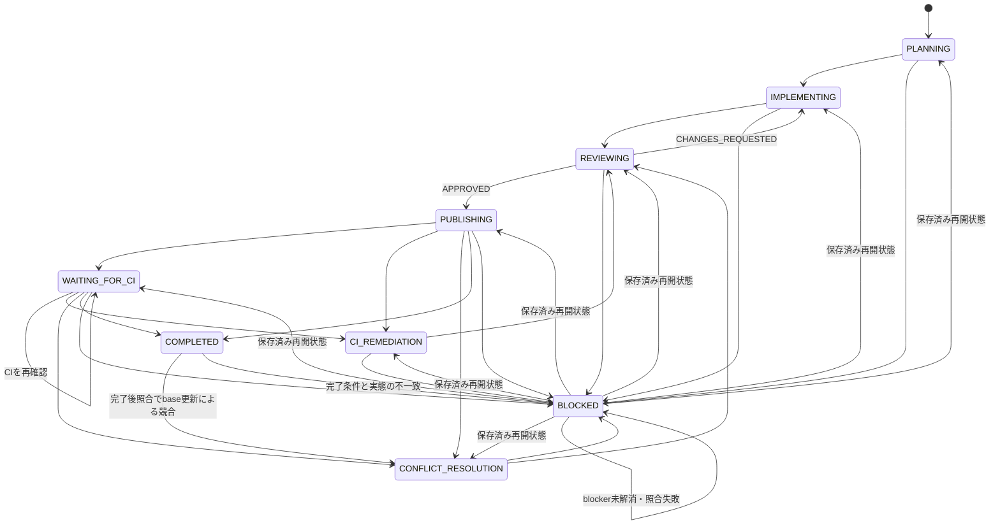

# 単一Issue Runの基礎状態モデル

## 目的

本書は、Issue Agent Skillsが扱う単一のGitHub Issueについて、Loop Engineeringの不変な設計契約を定義する。後続の証跡、停止・再開、CIの設計は、本書の用語と状態モデルを参照する。

## 対象範囲

実行単位は、1件のIssueに対する1つの`Run`である。`Run`は停止と再開をまたいで同一性を保ち、複数Issueをまたがない。

本書は`docs/loop-engineering.md`を設計契約の単一の正とする。一方、Issueごとに変化する現在状態や実行中の記録はrepository文書に保存しない。設計契約と実行状態を分離することで、状態更新によるcommit、複数Issue間の編集競合、古い実行状態の残存を避ける。

## Run識別子

OrchestratorはPlanner開始前に一意なrun IDを発行する。同じRunを停止地点から再開するときは、同じrun IDを再利用する。利用者が以前のRunを明示的に破棄し、最初から再実行すると決めた場合だけ、新しいrun IDを発行する。

既存Runと新規実行が競合する場合、run IDの再利用または新規発行を推測して決めず、`BLOCKED`とする。

## 永続保存directory

完全成果物は、公開Issueを代替保存先にせず、権限制限されたlocal filesystem backendへ保存する。この節は新規Runの保存先を発見・作成する契約だけを定め、完全成果物の形式は定めない。

### 保存先の決定

- 保存rootは`ISSUE_AGENT_STATE_DIR`が設定されていればその値とし、未設定なら`${XDG_STATE_HOME:-$HOME/.local/state}/issue-agent-runs`とする。
- `repository-id`は、remote URLから認証情報を除き、末尾の`/`を除き、任意の末尾`.git`を除いた正規化URLをUTF-8で符号化してSHA-256を計算した値とする。
- run IDを発行した後、Run directoryは`<root>/<repository-id>/<Issue番号>/<run ID>`と決定する。再開時も同じrepository-id、Issue番号、run IDからこのpathを決定的に発見する。

### directoryの安全性

保存root、`repository-id`およびIssue番号の中間directory、Run directoryは、いずれも実効ユーザーが所有する非symlink directoryでなければならず、所有者以外にアクセスを許さない`0700`相当のmodeでなければならない。各pathを解決した結果は、保存root自身または解決済み保存rootの配下でなければならない。これらの検証は、親directoryからRun directoryまでの各段階で行い、symlink、path traversal、root外への解決を許容しない。

Bootstrapは保存rootを読み取り専用で診断する。明示承認された初期化時に限り、不足している標準保存rootを作成できる。Orchestratorは保存rootの安全性を検証した後に限り、その配下の中間directoryとRun固有directoryを扱う。既存の不安全なdirectoryについて、所有者、mode、種別またはsymlinkを自動修復してはならない。

### 新規Runの作成

新規Runでは、Orchestratorがrun IDを先に発行し、検証済み保存root配下で決定的な中間directoryを作成・検証する。その後、検証済みの親directoryに決定的なRun directoryを原子的に作成し、作成直後に所有者、種別、mode、symlinkではないこと、resolved pathのroot配下性を再検証する。この順序により、run IDの発行とRun directory作成の循環を生じさせない。

同じrun IDのRun directoryが既に存在する場合、上書きしてはならない。既存Runとの同一性を照合できる場合だけそのRunを扱い、照合できなければ`BLOCKED`とする。中間directoryまたはRun directoryの作成・再検証に失敗した場合も、権限修復、代替保存先、公開Issueへの保存によって続行してはならない。安全な要約として部分状態を記録し、`BLOCKED`とする。

## 状態とIssueラベル

| 状態 | 意味 | Issueラベル |
| --- | --- | --- |
| `PLANNING` | Plannerが実装計画を作成中 | `status:in-progress` |
| `IMPLEMENTING` | Implementerが実装またはレビュー指摘を修正中 | `status:in-progress` |
| `REVIEWING` | Reviewerが変更を独立して確認中 | `status:review` |
| `PUBLISHING` | 承認済み変更を公開可能なPRへ反映中 | `status:review` |
| `WAITING_FOR_CI` | 必須CIは継続中で、現在のOrchestrator実行は待機を終了した状態 | `status:review` |
| `CI_REMEDIATION` | 実装起因と説明できるCI失敗を修正中 | `status:in-progress` |
| `CONFLICT_RESOLUTION` | Issue branchの競合を解消中 | `status:in-progress` |
| `COMPLETED` | Runの完了条件を満たし、完了として記録された状態 | `status:review` |
| `BLOCKED` | 人の判断、権限、外部状態変更、または範囲外対応を待つ再開可能な停止状態 | `status:blocked` |

## 許可遷移

状態遷移は次に限定する。



- 通常進行は`PLANNING`から`IMPLEMENTING`、`REVIEWING`、`PUBLISHING`へ進み、完了条件を満たすと`COMPLETED`となる。
- Reviewerの`CHANGES_REQUESTED`は`IMPLEMENTING`へ戻し、修正後は再び`REVIEWING`へ進む。
- `PUBLISHING`または`WAITING_FOR_CI`で、実装起因と説明できるCI失敗を検出した場合は`CI_REMEDIATION`へ進み、修正後に`REVIEWING`へ戻る。
- publish後または待機中にIssue branchの競合が発生した場合は`CONFLICT_RESOLUTION`へ進み、解消後に`REVIEWING`へ戻る。
- 進行中の必須CIを待機状態として引き継ぐ場合は`WAITING_FOR_CI`へ進む。これは失敗ではない。
- `COMPLETED`を再確認して実態が一致すれば状態を変更せず完了を報告する。base更新による競合だけは`CONFLICT_RESOLUTION`へ、その他の完了条件との不一致は`BLOCKED`へ進む。

## 停止と再開

`BLOCKED`は現在のOrchestrator実行を終了する状態である。ただしRun自体の終端ではない。blockerの解消後、再開前の照合に成功した場合だけ、同じrun IDで保存済みの再開状態へ遷移する。新しい実行が再開状態を推測して選んではならない。

### 明示再実行時だけの再開

停止済みRunの再開は、利用者または呼出し元が同じIssueを明示的に再実行した場合に限る。再実行要求でrun IDの指定を必須にしてはならない。Orchestrator、スケジューラ、CIポーリング、paneその他の実行環境は、停止済みRunを自動的に再開してはならない。再実行要求がない限り、保存済み再開状態は参照用の証跡であり、状態遷移を発生させない。

明示再実行では、対象Issueの単一active marker付き状態コメントとprivate backendの完全成果物からrun IDを取得し、両者を照合する。run IDを特定できない、active markerが単一でない、または両者が一致しない場合は`BLOCKED`とする。照合できたrun IDについて、branch、公開済みcommit、remote branch、worktree fingerprint、累積Implementer manifest、conflict-resolution manifest、reconciliation manifest、Draft PR、Issueラベル、必須CIおよびPRのhead SHAを実態から取得して照合する。Git、GitHub、CIの実態は保存状態より優先するが、安全に説明できない差分を自動整合してはならない。pane ID、端末、agentプロセスIDなどの一時的な実行環境はRun同一性の要件に含めない。

照合対象がすべて保存済み証跡と一致する場合、`WAITING_FOR_CI`はblocker解消を要求せず、同じrun IDで保存済みの`resume_state`および最後に検証済みのcheckpointから再開する。`BLOCKED`は停止理由となったblockerも解消済みである場合だけ、同じ方法で再開する。Runを新規作成するのは、利用者が以前のRunを明示的に破棄して最初から実行すると決めた場合だけである。明示的な破棄がない限り、再実行要求を新規Runとして扱ったり、run IDを再発行したりしてはならない。

外部変更は、保存済み証跡との因果関係および変更主体を説明でき、reconciliation manifestへ完全に帰属できる場合だけ照合対象に含められる。未把握の変更、未レビューの変更、説明不能な変更、別Runに帰属する変更、または未解消blockerがある場合は、再開状態を推測せず`BLOCKED`とする。

`COMPLETED`の再実行でも同じ照合を行う。一致する場合は同じrun IDの完了結果を報告し、Roleの再処理、CIの再待機、PRやラベルの更新を行わない。base更新によるIssue branchの競合だけは`CONFLICT_RESOLUTION`へ遷移できる。base競合以外の不一致はすべて`BLOCKED`とする。`CONFLICT_RESOLUTION`による変更を含め、3種のmanifestの和集合に変更がある場合は、新たなReviewerがその和集合を再レビューして承認するまでpublishまたは完了に進めない。

| シナリオ | 入力 | 期待結果 |
| --- | --- | --- |
| `WAITING_FOR_CI`の正常再開 | 明示再実行、private成果物、公開状態、Git/PR/CI、3種のmanifestが一致 | blocker解消を要求せず、同じrun IDで保存済み`resume_state`および最後に検証済みのcheckpointから再開する |
| `BLOCKED`の再開／blocker未解消 | 明示再実行で全照合対象が一致しblockerが解消済み、または保存済み停止理由がなお未解消 | 解消済みなら同じrun IDで保存済み`resume_state`およびcheckpointから再開し、未解消なら`BLOCKED`を維持する |
| 状態不一致 | 未把握commit、未レビュー変更、説明不能なfingerprint差分、別Runとの競合、またはbase競合以外の不一致 | 状態を上書きせず`BLOCKED`とする。説明可能な外部変更だけはreconciliation manifestへ記録する |
| 完了済み再確認 | `COMPLETED`で全照合対象が一致 | 同じrun IDの完了結果を報告し、Role、CI、PR、ラベルを再処理しない |
| base conflict | `COMPLETED`または再開対象のRunで、base更新によるIssue branchの競合だけがある | 同じrun IDで`CONFLICT_RESOLUTION`へ遷移し、3種のmanifestの和集合を新たなReviewerが再レビューする |

### 反復と安全停止の判定

ReviewerからImplementerへ差し戻す既定上限は3回とする。対象Issueが上限を明示している場合だけ、その値で上書きできる。1回目から3回目の`CHANGES_REQUESTED`では`IMPLEMENTING`へ戻すが、4回目の`CHANGES_REQUESTED`が必要になった時点では差し戻さず`BLOCKED`とする。

差し戻し上限に達していなくても、修正を試みた後に同一の指摘または同一のテスト失敗が連続2回観測された場合は、直ちに`BLOCKED`とする。同様に、累積manifest、テスト結果、指摘内容のすべてに実質的な進展がない周回が連続2回になった場合も`BLOCKED`とする。これらの比較はRun全体のprivate backendに保存した要約で行い、以前の値を推測してはならない。

次の条件は回数を待たず、検出時点で`BLOCKED`とする。

- 必要な権限がない。
- 安全性に関する判断を自律的に確定できない。
- Issueの対象範囲外の変更が必要である。
- 利用者の開始前変更または第三者の変更と競合する。
- 保存済み状態と実態に説明不能な不一致がある。

未解決の失敗を成功として扱ってはならず、Reviewerの承認も推測してはならない。

| 判定対象 | 入力 | 期待結果 |
| --- | --- | --- |
| 差し戻し回数 | 1〜3回目の`CHANGES_REQUESTED` | `IMPLEMENTING`へ遷移する |
| 差し戻し回数 | 4回目の`CHANGES_REQUESTED`が必要 | `BLOCKED`とし、Implementerへ再差し戻ししない |
| 同一失敗の反復 | 修正後も同一指摘または同一テスト失敗が連続2回 | `BLOCKED` |
| 無進展 | manifest、テスト、指摘のすべてに進展なしが連続2周 | `BLOCKED` |
| 即時停止 | 権限不足、安全性判断不能、範囲外変更、既存変更との競合、説明不能な保存状態不一致 | 直ちに`BLOCKED` |

### 停止証跡と再開状態

`BLOCKED`へ遷移するとき、Orchestratorは次の完全な停止証跡をprivate backendへ保存する。

- 停止条件と根拠
- 停止直前状態
- 保存済み再開状態
- 最後に検証済みのopaque checkpoint
- 再開に必要な利用者の判断または外部状態の変更

停止直前状態と保存済み再開状態は別々の値として保存し、一方から他方を推測してはならない。

公開Issueのactive marker付き状態コメントには、既存schemaに従い、`state_before_stop`、`resume_state`、`stop_or_wait_reason`、`opaque_checkpoint`、`safe_summary`、`redacted_integrity`を記録する。これらには停止直前状態、保存済み再開状態、停止理由および再開に必要な情報を、安全化・秘匿化した範囲で含める。`BLOCKED`のcheckpointコメントも既存のcheckpoint契約に従い、停止直前状態、停止理由、opaque checkpoint、安全な要約および秘匿化済み整合性表現を記録する。

停止根拠の完全な詳細、完全な保存済み状態、再開に必要な判断または外部変更の詳細、および完全成果物はprivate backendにのみ保存する。公開Issueをprivate backendの代替保存先として使用してはならない。

## Worktree fingerprintとRole変更帰属

Orchestratorは、Roleの呼出し前後、再開前、Reviewerの確認前、およびpublish直前にworktree fingerprintを取得してprivate backendへ完全な形で保存する。fingerprintは少なくとも次を含む。

- `HEAD`のcommit SHA
- `git status --porcelain=v1 -uall`の完全な出力
- statusに現れた各pathについて、indexとworktreeそれぞれのblob ID、mode、存在または削除状態

pathの同一性はpath名だけで判定しない。indexおよびworktreeのblob ID、mode、存在・削除状態の組をそのpathのidentityとして比較する。indexまたはworktreeにentryが存在しない場合も、その不在を明示して記録する。未追跡pathを含め、`-uall`で観測されるすべての変更pathを対象とする。

完全fingerprint、生のpath、blob ID、完全manifestおよび比較結果はprivate backendだけに保存する。公開Issueには、opaque checkpoint、安全な要約、復元不能な秘匿化済み整合性表現だけを保存する。公開Issueを完全fingerprintまたはprivate backendの代替保存先にしてはならない。

### Role呼出しの帰属根拠

OrchestratorはRole呼出しごとに一意な呼出しIDを発行し、次の組を一体の帰属根拠としてprivate backendへ保存する。

- 呼出し直前fingerprint
- 呼出し返却直後fingerprint
- Role Outcome
- Roleが返却した完全manifest

manifestは由来別に混在させない。Implementerの変更は累積Implementer manifest、Conflict Resolverの変更はconflict-resolution manifest、利用者・第三者・別RunなどRole外部の変更はreconciliation manifestへそれぞれ記録する。base SHAのblobと同一であることを検証できた自動merge由来の変更は、Run作成manifestへ混在させない。

呼出し前後の差分が返却manifestと一致し、そのmanifest内のpathだけでidentityが変化した場合、その変化は正常なRole変更である。この場合、Implementerには追加の外部証跡を要求しない。初回呼出しを含むImplementerの返却成果物は、この呼出し境界の照合に成功した後だけ、永続成果物および検証済みcheckpointへ昇格できる。

返却manifest外の新規または変更path、Role呼出し境界外のidentity変化、または同一pathへの説明不能な並行変更を検出した場合、Orchestratorは当該変更の内容を開かず`BLOCKED`とする。安全な要約とopaque checkpointだけを公開し、照合済みの証跡を損なわない。

### レビューとpublishの固定

Reviewerは、累積Implementer manifest、conflict-resolution manifest、reconciliation manifestの和集合とbaseとの差分を確認する。承認後にpublishできるのは、Reviewerが確認したものと同じfingerprintだけである。publish直前のfingerprintが異なる場合は、内容を推測または追加確認せず、帰属照合へ戻し、照合不能なら`BLOCKED`とする。

## 公開状態コメントと監査証跡

公開Issueは、完全な永続保存backendではない。対象Issueにおける現行Runを安全に発見する状態索引と、重要な判断を監査するための要約だけを担う。完全成果物、累積manifestその他の詳細はprivate backendに保存し、公開Issueからはopaque checkpointで対応付ける。

### 現行Runの発見

現行Runの専用状態コメントには、次のhidden markerを含める。

```text
<!-- issue-agent-run-state:active:v1 -->
```

- 対象Issueには、active markerを含むコメントがちょうど1件だけ存在しなければならない。この一意性はIssueごとに判定する。
- Orchestratorはhidden markerでこのコメントを機械的に発見する。人向けにIssue本文へ索引を置くことは要求しない。
- marker付きコメントが欠落または重複している場合、現行Run、run ID、再開状態を推測してはならない。安全に特定できないため`BLOCKED`として差分を記録する。

### 状態コメントv1 schema

active marker付きコメントは、少なくとも次の公開可能な要約を持つ。値が未確定または取得不能な場合は、その事実を安全な要約として記録し、推測値で補完しない。

| field | 内容 |
| --- | --- |
| `run_id` | 対象Issue内で識別するRun ID |
| `started_at` / `updated_at` | Run開始時刻と状態コメントの最終更新時刻 |
| `current_state` | 現在の状態 |
| `state_before_stop` | 停止している場合の停止直前状態。それ以外は未設定であること |
| `resume_state` | 照合成功後に再開する保存済み状態。再開不能または未確定ならその理由 |
| `role` / `model` | 現在または直近のRoleと使用モデル |
| `outcome` | 直近のRoleまたはRunのOutcome |
| `review_return_count` | ReviewerからImplementerへ差し戻した回数 |
| `test_summary` | 実行した検証の要約、成否、未実行ならその理由 |
| `branch` / `commit` | 公開repositoryのbranch名とcommit SHA。公開済みrepositoryのcommit SHAは許可対象 |
| `draft_pr` / `head_sha` | Draft PR参照と公開repositoryのhead SHA。未作成ならその状態。公開済みrepositoryのhead SHAは許可対象 |
| `ci_summary` | 必須CIの要約、判定、継続中または未確認ならその状態 |
| `stop_or_wait_reason` | `BLOCKED`または待機中の理由。該当しない場合は未設定であること |
| `opaque_checkpoint` | private backend内の完全成果物を公開せずに対応付ける不透明なcheckpoint識別子 |
| `safe_summary` | 判断、進捗、再開に必要な公開可能な要約 |
| `redacted_integrity` | 秘匿化済みの整合性表現。元の成果物、path、Git objectを復元できる値は置かない |
| `token_count` / `cost` | 取得できる場合だけ記録する任意のtoken数と費用。取得不能は失敗ではない |

`opaque_checkpoint`、`safe_summary`、`redacted_integrity`は、公開情報とprivate backendの完全成果物を安全に対応付ける最小限の組である。公開Issueだけをprivate backendの代替保存先として使用してはならない。

### 更新とcheckpoint

通常の細かな状態遷移は、同じactive marker付き状態コメントを更新する。これにより、現行状態を一意に保つ。

次の重要な出来事は、markerを含めない新規checkpointコメントとしてIssueタイムラインへ追記する。

- `BLOCKED`への停止
- 保存済み状態への再開
- Reviewerの`APPROVED`
- publish完了

各checkpointコメントには、run ID、出来事の時刻、状態遷移、opaque checkpoint、安全な要約、秘匿化済み整合性表現を記録する。停止時は停止直前状態と停止理由を、再開時は照合済みの再開状態を含める。checkpointは監査履歴であり、active markerを付与して現行状態コメントとして扱ってはならない。

利用者が以前のRunを明示的に破棄して最初から実行する場合は、次の順に処理する。

1. 旧Runのrun ID、要約、破棄理由をmarkerなしのcheckpointコメントとして残す。この時点では既存のactive marker付き状態コメントを変更しない。
2. 既存の単一active marker付き状態コメントを、markerを残したまま新Runのrun ID、初期状態、schemaの各値へ更新する。新しいmarker付きコメントは作成せず、旧コメントからmarkerを削除もしない。

この手順ではactive marker付きコメントを常に1件に保てる。開始前に単一のactive marker付きコメントを特定できない場合、または更新後の一意性を確認できない場合は、新Runを開始せず`BLOCKED`とする。

## 必須CIの監視と`WAITING_FOR_CI`

`PUBLISHING`では、Draft PRの現在のhead SHAに対して要求される必須CIを特定してから完了可否を判断する。この間もIssueラベルは`status:review`を維持する。`WAITING_FOR_CI`はCIの失敗やキャンセルではなく、CIを継続したまま現在のOrchestrator実行だけを終了する再開可能な状態である。

### 必須checkの特定

- OrchestratorはPRのbaseとなるdefault branchを特定し、そのbranch protectionと適用されるrulesetの両方から、現在のPR head SHAに要求される必須checkを取得する。branch protectionだけ、またはrulesetだけを根拠に、他方の要件を未設定と推測してはならない。
- required status checks、required workflows、merge queueその他の適用条件を、PR、base branch、head SHAおよびGitHubが返す実態に対応付ける。同名checkの混同、過去headのcheck、別workflowの結果で充足を判定してはならない。
- 権限不足、APIの取得不能、適用rulesetの解釈不能、required checkとhead SHAの対応不能、または要件の競合により必須checkを信頼できる方法で特定できない場合は、必須checkなしと推測せず`BLOCKED`とする。停止根拠と最後に安全に確認できた情報はprivate backendへ完全に保存し、公開Issueには安全な要約だけを記録する。
- 必須checkの集合は、PR URL、head SHA、check識別子および判定根拠とともにRun状態へprivateに保存する。公開状態コメントにはPR参照、公開repositoryのhead SHA、CI要約、opaque checkpoint、安全な要約および秘匿化済み整合性表現だけを保存し、完全なAPI応答、ログ、内部識別子は保存しない。

### 観測と進捗

必須checkの特定に成功した後、Orchestratorは30秒ごとに現在のhead SHAのCI実態を確認する。各観測で、checkごとの状態、結論、関連jobおよびstepの状態、観測時刻をprivate backendへ保存する。

次のいずれかを観測したときは、CIが継続している間の進捗として扱い、無進捗の連続時間をその観測時刻から数え直す。

- jobまたはstepの開始
- jobまたはstepの完了
- jobまたはstepの状態切替

ログ末尾から安全に計算した復元不能なhashの変化は補助的な進捗根拠にできる。ただし、ログ本文、ログ行数、`tail`の変化だけを進捗判定の根拠にしてはならない。CI生ログおよびhashの入力はprivate backendにだけ保存する。

状態の観測結果と利用している補助ログ根拠の双方に、CIが継続中のまま5分間変化がない場合、OrchestratorはCIを失敗またはキャンセルとして扱わず、`WAITING_FOR_CI`へ遷移して実行を終了する。このcheckpointには、同一PR、head SHA、必須checkの集合、各checkの最後に観測した状態、最終観測時刻、次回再開地点をprivate backendへ完全に保存する。公開状態コメントとcheckpointコメントには、待機理由と安全なCI要約だけを記録する。

| 観測結果 | 条件 | 遷移・処理 |
| --- | --- | --- |
| 必須checkを特定不能 | 要求されるcheckをhead SHAに対応付けられない、または取得・解釈不能 | `BLOCKED`。必須checkなしとは推測しない |
| CI進捗あり | 30秒確認でjob/stepの開始、完了または状態切替を観測 | `PUBLISHING`を維持し、最終観測と進捗根拠を保存して確認を継続 |
| 補助根拠のみ変化 | 安全なログ末尾hashが変化し、状態変化は未観測 | 補助根拠として保存して確認を継続する。本文、行数、`tail`単独では進捗としない |
| CI継続中かつ5分無変化 | 状態と補助ログ根拠の双方に5分間変化がない | `WAITING_FOR_CI`へ遷移し、CIを継続したまま実行を終了 |
| CIの失敗またはキャンセル | 必須checkが終了し失敗またはキャンセルを観測 | 現在のhead SHAに対する終端結果を、後続する「必須CIの終端結果分類と修復」に従って処理する |

### `WAITING_FOR_CI`からの明示再実行

`WAITING_FOR_CI`のCI確認は、利用者または呼出し元による同じIssueの明示再実行でのみ再開できる。スケジューラ、CIイベント、ポーリング、paneその他の実行環境が自動再開してはならない。

再開前にOrchestratorは、保存済みcheckpointのPR、head SHA、必須check集合と、実際のPR、head SHA、適用される必須check集合を照合する。すべて一致するときだけ、同じrun IDで保存済みの再開地点から30秒確認を再開する。PRの同一性、head SHAまたは必須check集合のいずれかが一致しない、または安全に照合できない場合は、状態を推測・上書きせず`BLOCKED`とする。

| シナリオ | 入力 | 期待結果 |
| --- | --- | --- |
| CI無変化 | 必須CIが継続中で、状態と補助ログ根拠の双方が5分間無変化 | `WAITING_FOR_CI`。同一PR、head SHA、必須check、最終状態、最終観測、再開地点を保存して実行終了 |
| 監視再開 | 明示再実行、保存済みPR/head SHA/必須checkと実態が一致 | 同じrun ID・checkpointからCI確認を再開 |
| 監視再開の不一致 | 明示再実行だがPR、head SHA、必須checkのいずれかが不一致または照合不能 | `BLOCKED`。別PRや新しいheadの監視を推測して開始しない |

### 必須CIの終端結果分類と修復

必須CIが終端状態になったときは、各checkの結果を現在のPR head SHAに対応付けたまま分類する。`CI_REMEDIATION`へ遷移できるのは、失敗が今回の実装変更に起因すると安全に説明でき、Issueの対象範囲内で修正できる場合だけである。失敗の文面だけ、過去の類似、または推測によって実装起因と判定してはならない。

flakyな失敗、GitHub Actionsまたは外部サービスの障害、原因不明の失敗、`cancelled`、`timed_out`、`action_required`、および安全に分類できない終端結果は、すべて`BLOCKED`とする。既存の差し戻し回数上限、同一の指摘またはテスト失敗が連続2回となる停止条件、連続2周の無進展停止条件も、CI修復にそのまま適用する。これらに該当する場合は修復を試みず、または継続せず`BLOCKED`とする。

`CI_REMEDIATION`におけるImplementerのRole呼出しにも、呼出しID、呼出し前後のfingerprint、Role Outcome、返却された完全manifestからなる既存の帰属根拠を適用する。照合に成功した変更だけを累積Implementer manifestへ完全に帰属し、失敗を再現または検証する関連テストを実行する。修復後は同じReviewerが、累積Implementer manifest、conflict-resolution manifest、reconciliation manifestの和集合を再レビューして明示的に再承認しなければならない。Reviewerが確認・承認した変更だけを同じIssue branchへ再publishできる。再publish後は新しいPR head SHAを保存し、そのSHAに対応する必須CIを改めて特定して監視する。以前のhead SHAの結果、未レビューの変更、または別branchへのpublishで完了を判定してはならない。

`COMPLETED`への遷移は、次の論理積をすべて満たすときに限る。

- Reviewerの明示的な承認があり、その承認対象fingerprintが現在の変更と一致している。
- 累積Implementer manifest、conflict-resolution manifest、reconciliation manifestの3種が由来別に保存・照合され、その和集合をReviewerが確認している。
- default branchをbaseとするDraft PRが存在する。
- PRのhead SHA、保存済みhead SHA、および必須CIを評価したSHAが一致している。
- 同一SHAの全必須CIが成功している、または必須CIが未設定であることをbranch protectionと適用rulesetの双方から取得・記録している。
- 状態コメントとprivate backendのcheckpointが`COMPLETED`、判定根拠、PR、head SHA、CI要約に更新されている。

この完了はDraft PRを解除すること、追加の承認を得ること、mergeすること、branchを削除すること、またはworktreeをcleanupすることを含まない。

| シナリオ | 入力 | 期待結果 |
| --- | --- | --- |
| 正常完了 | 同一head SHAの全必須CIが成功し、`COMPLETED`の全条件を満たす | 状態コメントとcheckpointを更新して`COMPLETED`。Draft解除、承認、merge、branch削除、worktree cleanupは行わない |
| 必須CI未設定 | branch protectionと適用rulesetの双方から、当該head SHAに必須CIがないと取得・記録でき、他の完了条件を満たす | 必須CI未設定の根拠を記録して`COMPLETED` |
| 実装起因の失敗 | 現在のhead SHAの必須CI失敗を今回の実装変更に安全に帰属でき、関連テストと対象範囲内の修正が可能 | `CI_REMEDIATION`。変更帰属・関連テスト・同じReviewerの再承認後、同じbranchへ再publishし、新head SHAを監視する |
| 外部・原因不明の失敗 | flaky、GitHub Actions・外部障害、原因不明、`cancelled`、`timed_out`、`action_required`、または分類不能な終端結果 | 根拠を保存して`BLOCKED`。成功または実装起因として推測しない |

### 公開禁止情報

公開Issueの状態コメントとcheckpointコメントには、次を保存してはならない。

- 会話全文、完全成果物、累積manifest、patch、コマンド出力全文、CI生ログ
- 認証情報、token、秘密情報、個人情報、秘密を含み得る環境値
- 生のfilesystem path、private backendの実体位置、公開していない内部参照
- unsalted Git blob ID、非公開成果物またはprivate backendのobject識別子など、非公開の成果物・Git objectを直接特定または復元できる値

公開repositoryの`commit`および`head_sha`は、schemaに定める許可対象であり、この禁止対象には含めない。その他の公開に必要な情報は、これらの代わりに`safe_summary`、`opaque_checkpoint`、`redacted_integrity`を用いる。状態コメントの更新とcheckpointの作成は、この公開境界を破らない範囲で行う。

## 受入シナリオ

通常のBootstrap `verify`は、Markdownで定義した本契約、Skill契約、validatorおよび差分を**読み取り専用で確認する**。状態遷移を判定するプログラムや自動シナリオテストは追加しない。実動経路の確認は、明示承認されたlive verifyだけで行う。実際に通過していない経路を、live verify済みまたは成功済みとして報告してはならない。

| シナリオ | 入力 | 期待結果 | 対応する既存契約・決定 |
| --- | --- | --- | --- |
| 正常完了 | Reviewerが明示承認し、Draft PR、同一head SHAの必須CI成功、その他の完了条件がそろう | 証跡を更新して`COMPLETED`。Draft解除、承認、mergeは行わない | 「必須CIの終端結果分類と修復」・完了条件（#17） |
| 必須CI未設定 | branch protectionと適用rulesetの双方から、当該head SHAの必須CIなしを取得・記録でき、他の完了条件を満たす | 未設定の根拠を保存して`COMPLETED` | 「必須CIの終端結果分類と修復」・完了条件（#16、#17） |
| レビュー差し戻し | Reviewerが1〜3回目の`CHANGES_REQUESTED`を返す | `IMPLEMENTING`へ戻し、修正後に同じReviewerが再レビューする | 「許可遷移」・「反復と安全停止の判定」（#10、#13） |
| 4回目差し戻し | 4回目の`CHANGES_REQUESTED`が必要になる | Implementerへ再差し戻しせず`BLOCKED` | 「反復と安全停止の判定」（#13） |
| 同一失敗連続 | 修正後も同一指摘または同一テスト失敗を連続2回観測する | 直ちに`BLOCKED` | 「反復と安全停止の判定」（#13） |
| 無進展 | manifest、テスト結果、指摘内容のすべてに実質的進展がない周回を連続2回観測する | `BLOCKED` | 「反復と安全停止の判定」（#13） |
| `BLOCKED`の明示再開 | 同じIssueの明示再実行で、保存済み証跡と実態が一致し、blockerも解消済み | 同じrun IDで保存済み`resume_state`とcheckpointから再開する | 「明示再実行時だけの再開」・「停止証跡と再開状態」（#15） |
| `WAITING_FOR_CI`の明示再開 | 明示再実行で保存済みPR、head SHA、必須check集合と実態が一致する | 同じrun ID・checkpointから30秒確認を再開する | 「`WAITING_FOR_CI`からの明示再実行」（#15、#16） |
| 状態不一致 | 未把握commit、未レビュー変更、説明不能なfingerprint差分、別Runとの競合、またはbase競合以外の不一致がある | 状態を推測・上書きせず`BLOCKED` | 「明示再実行時だけの再開」・「Worktree fingerprintとRole変更帰属」（#12、#15） |
| CI無変化 | 必須CIが継続中で、状態と補助ログ根拠の双方に5分間変化がない | CIを継続したまま`WAITING_FOR_CI`へ遷移して実行を終了する | 「観測と進捗」・「`WAITING_FOR_CI`からの明示再実行」（#16） |
| 実装起因CI失敗 | 現在のhead SHAの必須CI失敗を今回の実装変更に安全に帰属でき、対象範囲内で修正可能 | `CI_REMEDIATION`へ遷移し、関連テスト、再レビュー、再publish後に新head SHAを監視する | 「必須CIの終端結果分類と修復」（#17） |
| 外部／原因不明CI失敗 | flaky、GitHub Actions・外部障害、原因不明、`cancelled`、`timed_out`、`action_required`、または分類不能な終端結果 | 成功・実装起因と推測せず根拠を保存して`BLOCKED` | 「必須CIの終端結果分類と修復」（#17） |
| P1回帰: 新規Run directory作成 | run ID発行後、検証済み保存root配下で新規Runを開始する | 中間directoryとRun directoryを決定的・原子的に作成し、所有者、mode、非symlink、root配下性を再検証する | 「新規Runの作成」（#11） |
| P1回帰: 通常Implementer変更の帰属 | Role呼出し前後のfingerprint差分が返却された累積Implementer manifestと一致し、manifest内のpathだけでidentityが変化する | 正常なImplementer変更として完全に帰属し、追加の外部証跡を要求しない | 「Role呼出しの帰属根拠」（#12） |

## 対象外

次は本書の対象外とし、後続の設計または実装で扱う。

- 複数Issue処理、スケジューラ、状態遷移を判定するプログラム、自動シナリオテスト
- private backendの完全成果物の保存形式
- 停止閾値と再開時の実態照合の詳細
- Orchestrator、Bootstrap、各RoleのSkill実装
- CIポーリングの実装、worktree fingerprintの直列化形式、およびprivate backendの初期化実装
- 明示再実行なしにRunを再開する自動再開機構
- CIイベントによるCodexの自動起動または再開、GitHub Actions workflowの追加・変更
- live verifyの実行、PRのDraft解除・承認・merge
