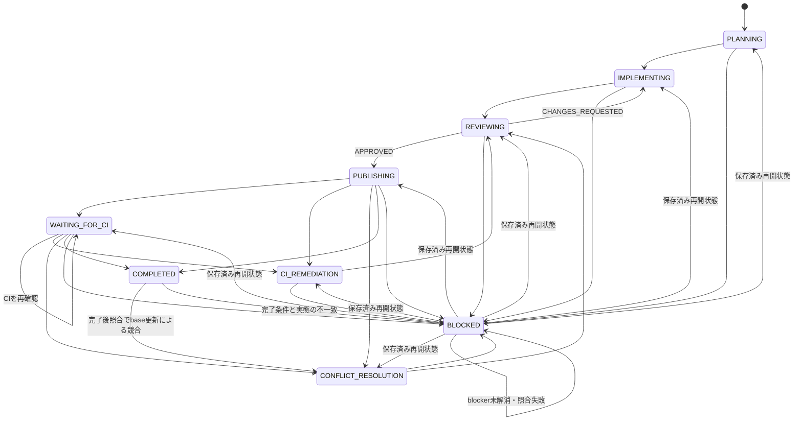

# 単一Issue Runの基礎状態モデル

## 目的

本書は、Issue Agent Skillsが扱う単一のGitHub Issueについて、Loop Engineeringの不変な設計契約を定義する。後続の証跡、停止・再開、CIの設計は、本書の用語と状態モデルを参照する。

## 対象範囲

実行単位は、1件のIssueに対する1つの`Run`である。`Run`は停止と再開をまたいで同一性を保ち、複数Issueをまたがない。

本書は`docs/loop-engineering.md`を設計契約の単一の正とする。一方、Issueごとに変化する現在状態や実行中の記録はrepository文書に保存しない。設計契約と実行状態を分離することで、状態更新によるcommit、複数Issue間の編集競合、古い実行状態の残存を避ける。

## Run識別子

OrchestratorはPlanner開始前に一意なrun IDを発行する。同じRunを停止地点から再開するときは、同じrun IDを再利用する。利用者が以前のRunを明示的に破棄し、最初から再実行すると決めた場合だけ、新しいrun IDを発行する。

既存Runと新規実行が競合する場合、run IDの再利用または新規発行を推測して決めず、`BLOCKED`とする。

## 永続保存directory

完全成果物は、公開Issueを代替保存先にせず、権限制限されたlocal filesystem backendへ保存する。この節は新規Runの保存先を発見・作成する契約だけを定め、完全成果物の形式は定めない。

### 保存先の決定

- 保存rootは`ISSUE_AGENT_STATE_DIR`が設定されていればその値とし、未設定なら`${XDG_STATE_HOME:-$HOME/.local/state}/issue-agent-runs`とする。
- `repository-id`は、remote URLから認証情報を除き、末尾の`/`を除き、任意の末尾`.git`を除いた正規化URLをUTF-8で符号化してSHA-256を計算した値とする。
- run IDを発行した後、Run directoryは`<root>/<repository-id>/<Issue番号>/<run ID>`と決定する。再開時も同じrepository-id、Issue番号、run IDからこのpathを決定的に発見する。

### directoryの安全性

保存root、`repository-id`およびIssue番号の中間directory、Run directoryは、いずれも実効ユーザーが所有する非symlink directoryでなければならず、所有者以外にアクセスを許さない`0700`相当のmodeでなければならない。各pathを解決した結果は、保存root自身または解決済み保存rootの配下でなければならない。これらの検証は、親directoryからRun directoryまでの各段階で行い、symlink、path traversal、root外への解決を許容しない。

Bootstrapは保存rootを読み取り専用で診断する。明示承認された初期化時に限り、不足している標準保存rootを作成できる。Orchestratorは保存rootの安全性を検証した後に限り、その配下の中間directoryとRun固有directoryを扱う。既存の不安全なdirectoryについて、所有者、mode、種別またはsymlinkを自動修復してはならない。

### 新規Runの作成

新規Runでは、Orchestratorがrun IDを先に発行し、検証済み保存root配下で決定的な中間directoryを作成・検証する。その後、検証済みの親directoryに決定的なRun directoryを原子的に作成し、作成直後に所有者、種別、mode、symlinkではないこと、resolved pathのroot配下性を再検証する。この順序により、run IDの発行とRun directory作成の循環を生じさせない。

同じrun IDのRun directoryが既に存在する場合、上書きしてはならない。既存Runとの同一性を照合できる場合だけそのRunを扱い、照合できなければ`BLOCKED`とする。中間directoryまたはRun directoryの作成・再検証に失敗した場合も、権限修復、代替保存先、公開Issueへの保存によって続行してはならない。安全な要約として部分状態を記録し、`BLOCKED`とする。

## 状態とIssueラベル

| 状態 | 意味 | Issueラベル |
| --- | --- | --- |
| `PLANNING` | Plannerが実装計画を作成中 | `status:in-progress` |
| `IMPLEMENTING` | Implementerが実装またはレビュー指摘を修正中 | `status:in-progress` |
| `REVIEWING` | Reviewerが変更を独立して確認中 | `status:review` |
| `PUBLISHING` | 承認済み変更を公開可能なPRへ反映中 | `status:review` |
| `WAITING_FOR_CI` | 必須CIは継続中で、現在のOrchestrator実行は待機を終了した状態 | `status:review` |
| `CI_REMEDIATION` | 実装起因と説明できるCI失敗を修正中 | `status:in-progress` |
| `CONFLICT_RESOLUTION` | Issue branchの競合を解消中 | `status:in-progress` |
| `COMPLETED` | Runの完了条件を満たし、完了として記録された状態 | `status:review` |
| `BLOCKED` | 人の判断、権限、外部状態変更、または範囲外対応を待つ再開可能な停止状態 | `status:blocked` |

## 許可遷移

状態遷移は次に限定する。



- 通常進行は`PLANNING`から`IMPLEMENTING`、`REVIEWING`、`PUBLISHING`へ進み、完了条件を満たすと`COMPLETED`となる。
- Reviewerの`CHANGES_REQUESTED`は`IMPLEMENTING`へ戻し、修正後は再び`REVIEWING`へ進む。
- `PUBLISHING`または`WAITING_FOR_CI`で、実装起因と説明できるCI失敗を検出した場合は`CI_REMEDIATION`へ進み、修正後に`REVIEWING`へ戻る。
- publish後または待機中にIssue branchの競合が発生した場合は`CONFLICT_RESOLUTION`へ進み、解消後に`REVIEWING`へ戻る。
- 進行中の必須CIを待機状態として引き継ぐ場合は`WAITING_FOR_CI`へ進む。これは失敗ではない。
- `COMPLETED`を再確認して実態が一致すれば状態を変更せず完了を報告する。base更新による競合だけは`CONFLICT_RESOLUTION`へ、その他の完了条件との不一致は`BLOCKED`へ進む。

## 停止と再開

`BLOCKED`は現在のOrchestrator実行を終了する状態である。ただしRun自体の終端ではない。blockerの解消後、再開前の照合に成功した場合だけ、同じrun IDで保存済みの再開状態へ遷移する。新しい実行が再開状態を推測して選んではならない。

### 反復と安全停止の判定

ReviewerからImplementerへ差し戻す既定上限は3回とする。対象Issueが上限を明示している場合だけ、その値で上書きできる。1回目から3回目の`CHANGES_REQUESTED`では`IMPLEMENTING`へ戻すが、4回目の`CHANGES_REQUESTED`が必要になった時点では差し戻さず`BLOCKED`とする。

差し戻し上限に達していなくても、修正を試みた後に同一の指摘または同一のテスト失敗が連続2回観測された場合は、直ちに`BLOCKED`とする。同様に、累積manifest、テスト結果、指摘内容のすべてに実質的な進展がない周回が連続2回になった場合も`BLOCKED`とする。これらの比較はRun全体のprivate backendに保存した要約で行い、以前の値を推測してはならない。

次の条件は回数を待たず、検出時点で`BLOCKED`とする。

- 必要な権限がない。
- 安全性に関する判断を自律的に確定できない。
- Issueの対象範囲外の変更が必要である。
- 利用者の開始前変更または第三者の変更と競合する。
- 保存済み状態と実態に説明不能な不一致がある。

未解決の失敗を成功として扱ってはならず、Reviewerの承認も推測してはならない。

| 判定対象 | 入力 | 期待結果 |
| --- | --- | --- |
| 差し戻し回数 | 1〜3回目の`CHANGES_REQUESTED` | `IMPLEMENTING`へ遷移する |
| 差し戻し回数 | 4回目の`CHANGES_REQUESTED`が必要 | `BLOCKED`とし、Implementerへ再差し戻ししない |
| 同一失敗の反復 | 修正後も同一指摘または同一テスト失敗が連続2回 | `BLOCKED` |
| 無進展 | manifest、テスト、指摘のすべてに進展なしが連続2周 | `BLOCKED` |
| 即時停止 | 権限不足、安全性判断不能、範囲外変更、既存変更との競合、説明不能な保存状態不一致 | 直ちに`BLOCKED` |

### 停止証跡と再開状態

`BLOCKED`へ遷移するとき、Orchestratorは次の完全な停止証跡をprivate backendへ保存する。

- 停止条件と根拠
- 停止直前状態
- 保存済み再開状態
- 最後に検証済みのopaque checkpoint
- 再開に必要な利用者の判断または外部状態の変更

停止直前状態と保存済み再開状態は別々の値として保存し、一方から他方を推測してはならない。

公開Issueのactive marker付き状態コメントには、既存schemaに従い、`state_before_stop`、`resume_state`、`stop_or_wait_reason`、`opaque_checkpoint`、`safe_summary`、`redacted_integrity`を記録する。これらには停止直前状態、保存済み再開状態、停止理由および再開に必要な情報を、安全化・秘匿化した範囲で含める。`BLOCKED`のcheckpointコメントも既存のcheckpoint契約に従い、停止直前状態、停止理由、opaque checkpoint、安全な要約および秘匿化済み整合性表現を記録する。

停止根拠の完全な詳細、完全な保存済み状態、再開に必要な判断または外部変更の詳細、および完全成果物はprivate backendにのみ保存する。公開Issueをprivate backendの代替保存先として使用してはならない。

## Worktree fingerprintとRole変更帰属

Orchestratorは、Roleの呼出し前後、再開前、Reviewerの確認前、およびpublish直前にworktree fingerprintを取得してprivate backendへ完全な形で保存する。fingerprintは少なくとも次を含む。

- `HEAD`のcommit SHA
- `git status --porcelain=v1 -uall`の完全な出力
- statusに現れた各pathについて、indexとworktreeそれぞれのblob ID、mode、存在または削除状態

pathの同一性はpath名だけで判定しない。indexおよびworktreeのblob ID、mode、存在・削除状態の組をそのpathのidentityとして比較する。indexまたはworktreeにentryが存在しない場合も、その不在を明示して記録する。未追跡pathを含め、`-uall`で観測されるすべての変更pathを対象とする。

完全fingerprint、生のpath、blob ID、完全manifestおよび比較結果はprivate backendだけに保存する。公開Issueには、opaque checkpoint、安全な要約、復元不能な秘匿化済み整合性表現だけを保存する。公開Issueを完全fingerprintまたはprivate backendの代替保存先にしてはならない。

### Role呼出しの帰属根拠

OrchestratorはRole呼出しごとに一意な呼出しIDを発行し、次の組を一体の帰属根拠としてprivate backendへ保存する。

- 呼出し直前fingerprint
- 呼出し返却直後fingerprint
- Role Outcome
- Roleが返却した完全manifest

manifestは由来別に混在させない。Implementerの変更は累積Implementer manifest、Conflict Resolverの変更はconflict-resolution manifest、利用者・第三者・別RunなどRole外部の変更はreconciliation manifestへそれぞれ記録する。base SHAのblobと同一であることを検証できた自動merge由来の変更は、Run作成manifestへ混在させない。

呼出し前後の差分が返却manifestと一致し、そのmanifest内のpathだけでidentityが変化した場合、その変化は正常なRole変更である。この場合、Implementerには追加の外部証跡を要求しない。初回呼出しを含むImplementerの返却成果物は、この呼出し境界の照合に成功した後だけ、永続成果物および検証済みcheckpointへ昇格できる。

返却manifest外の新規または変更path、Role呼出し境界外のidentity変化、または同一pathへの説明不能な並行変更を検出した場合、Orchestratorは当該変更の内容を開かず`BLOCKED`とする。安全な要約とopaque checkpointだけを公開し、照合済みの証跡を損なわない。

### レビューとpublishの固定

Reviewerは、累積Implementer manifest、conflict-resolution manifest、reconciliation manifestの和集合とbaseとの差分を確認する。承認後にpublishできるのは、Reviewerが確認したものと同じfingerprintだけである。publish直前のfingerprintが異なる場合は、内容を推測または追加確認せず、帰属照合へ戻し、照合不能なら`BLOCKED`とする。

## 公開状態コメントと監査証跡

公開Issueは、完全な永続保存backendではない。対象Issueにおける現行Runを安全に発見する状態索引と、重要な判断を監査するための要約だけを担う。完全成果物、累積manifestその他の詳細はprivate backendに保存し、公開Issueからはopaque checkpointで対応付ける。

### 現行Runの発見

現行Runの専用状態コメントには、次のhidden markerを含める。

```text
<!-- issue-agent-run-state:active:v1 -->
```

- 対象Issueには、active markerを含むコメントがちょうど1件だけ存在しなければならない。この一意性はIssueごとに判定する。
- Orchestratorはhidden markerでこのコメントを機械的に発見する。人向けにIssue本文へ索引を置くことは要求しない。
- marker付きコメントが欠落または重複している場合、現行Run、run ID、再開状態を推測してはならない。安全に特定できないため`BLOCKED`として差分を記録する。

### 状態コメントv1 schema

active marker付きコメントは、少なくとも次の公開可能な要約を持つ。値が未確定または取得不能な場合は、その事実を安全な要約として記録し、推測値で補完しない。

| field | 内容 |
| --- | --- |
| `run_id` | 対象Issue内で識別するRun ID |
| `started_at` / `updated_at` | Run開始時刻と状態コメントの最終更新時刻 |
| `current_state` | 現在の状態 |
| `state_before_stop` | 停止している場合の停止直前状態。それ以外は未設定であること |
| `resume_state` | 照合成功後に再開する保存済み状態。再開不能または未確定ならその理由 |
| `role` / `model` | 現在または直近のRoleと使用モデル |
| `outcome` | 直近のRoleまたはRunのOutcome |
| `review_return_count` | ReviewerからImplementerへ差し戻した回数 |
| `test_summary` | 実行した検証の要約、成否、未実行ならその理由 |
| `branch` / `commit` | 公開repositoryのbranch名とcommit SHA。公開済みrepositoryのcommit SHAは許可対象 |
| `draft_pr` / `head_sha` | Draft PR参照と公開repositoryのhead SHA。未作成ならその状態。公開済みrepositoryのhead SHAは許可対象 |
| `ci_summary` | 必須CIの要約、判定、継続中または未確認ならその状態 |
| `stop_or_wait_reason` | `BLOCKED`または待機中の理由。該当しない場合は未設定であること |
| `opaque_checkpoint` | private backend内の完全成果物を公開せずに対応付ける不透明なcheckpoint識別子 |
| `safe_summary` | 判断、進捗、再開に必要な公開可能な要約 |
| `redacted_integrity` | 秘匿化済みの整合性表現。元の成果物、path、Git objectを復元できる値は置かない |
| `token_count` / `cost` | 取得できる場合だけ記録する任意のtoken数と費用。取得不能は失敗ではない |

`opaque_checkpoint`、`safe_summary`、`redacted_integrity`は、公開情報とprivate backendの完全成果物を安全に対応付ける最小限の組である。公開Issueだけをprivate backendの代替保存先として使用してはならない。

### 更新とcheckpoint

通常の細かな状態遷移は、同じactive marker付き状態コメントを更新する。これにより、現行状態を一意に保つ。

次の重要な出来事は、markerを含めない新規checkpointコメントとしてIssueタイムラインへ追記する。

- `BLOCKED`への停止
- 保存済み状態への再開
- Reviewerの`APPROVED`
- publish完了

各checkpointコメントには、run ID、出来事の時刻、状態遷移、opaque checkpoint、安全な要約、秘匿化済み整合性表現を記録する。停止時は停止直前状態と停止理由を、再開時は照合済みの再開状態を含める。checkpointは監査履歴であり、active markerを付与して現行状態コメントとして扱ってはならない。

利用者が以前のRunを明示的に破棄して最初から実行する場合は、次の順に処理する。

1. 旧Runのrun ID、要約、破棄理由をmarkerなしのcheckpointコメントとして残す。この時点では既存のactive marker付き状態コメントを変更しない。
2. 既存の単一active marker付き状態コメントを、markerを残したまま新Runのrun ID、初期状態、schemaの各値へ更新する。新しいmarker付きコメントは作成せず、旧コメントからmarkerを削除もしない。

この手順ではactive marker付きコメントを常に1件に保てる。開始前に単一のactive marker付きコメントを特定できない場合、または更新後の一意性を確認できない場合は、新Runを開始せず`BLOCKED`とする。

### 公開禁止情報

公開Issueの状態コメントとcheckpointコメントには、次を保存してはならない。

- 会話全文、完全成果物、累積manifest、patch、コマンド出力全文、CI生ログ
- 認証情報、token、秘密情報、個人情報、秘密を含み得る環境値
- 生のfilesystem path、private backendの実体位置、公開していない内部参照
- unsalted Git blob ID、非公開成果物またはprivate backendのobject識別子など、非公開の成果物・Git objectを直接特定または復元できる値

公開repositoryの`commit`および`head_sha`は、schemaに定める許可対象であり、この禁止対象には含めない。その他の公開に必要な情報は、これらの代わりに`safe_summary`、`opaque_checkpoint`、`redacted_integrity`を用いる。状態コメントの更新とcheckpointの作成は、この公開境界を破らない範囲で行う。

## 対象外

次は本書の対象外とし、後続の設計または実装で扱う。

- 複数Issue処理、スケジューラ、状態遷移を判定するプログラム
- private backendの完全成果物の保存形式
- 停止閾値と再開時の実態照合の詳細
- CI監視とRun完了条件の詳細
- Orchestrator、Bootstrap、各RoleのSkill実装
- GitHub Actions workflow、PRのDraft解除・承認・merge
