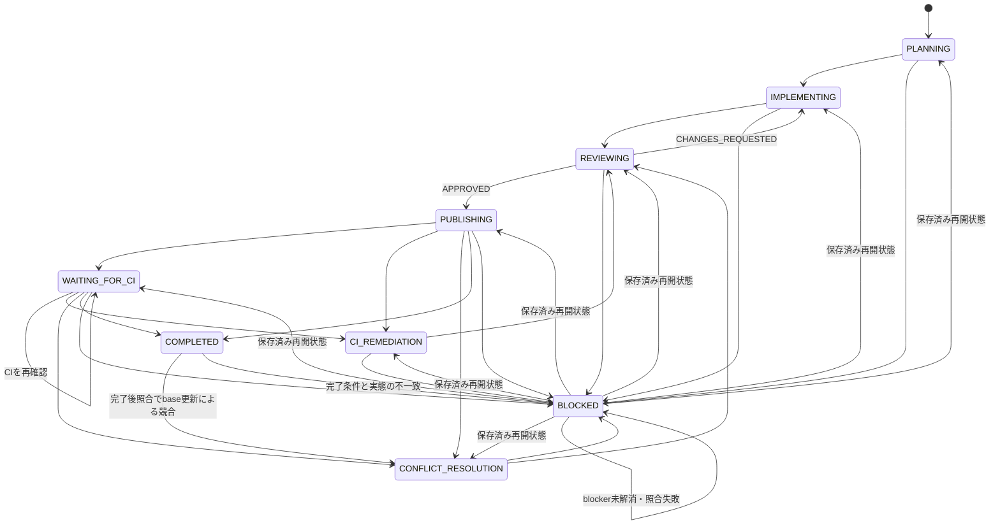

# 単一Issue Runの基礎状態モデル

## 目的

本書は、Issue Agent Skillsが扱う単一のGitHub Issueについて、Loop Engineeringの不変な設計契約を定義する。後続の証跡、停止・再開、CIの設計は、本書の用語と状態モデルを参照する。

## 対象範囲

実行単位は、1件のIssueに対する1つの`Run`である。`Run`は停止と再開をまたいで同一性を保ち、複数Issueをまたがない。

本書は`docs/loop-engineering.md`を設計契約の単一の正とする。一方、Issueごとに変化する現在状態や実行中の記録はrepository文書に保存しない。設計契約と実行状態を分離することで、状態更新によるcommit、複数Issue間の編集競合、古い実行状態の残存を避ける。

## Run識別子

OrchestratorはPlanner開始前に一意なrun IDを発行する。同じRunを停止地点から再開するときは、同じrun IDを再利用する。利用者が以前のRunを明示的に破棄し、最初から再実行すると決めた場合だけ、新しいrun IDを発行する。

既存Runと新規実行が競合する場合、run IDの再利用または新規発行を推測して決めず、`BLOCKED`とする。

## 状態とIssueラベル

| 状態 | 意味 | Issueラベル |
| --- | --- | --- |
| `PLANNING` | Plannerが実装計画を作成中 | `status:in-progress` |
| `IMPLEMENTING` | Implementerが実装またはレビュー指摘を修正中 | `status:in-progress` |
| `REVIEWING` | Reviewerが変更を独立して確認中 | `status:review` |
| `PUBLISHING` | 承認済み変更を公開可能なPRへ反映中 | `status:review` |
| `WAITING_FOR_CI` | 必須CIは継続中で、現在のOrchestrator実行は待機を終了した状態 | `status:review` |
| `CI_REMEDIATION` | 実装起因と説明できるCI失敗を修正中 | `status:in-progress` |
| `CONFLICT_RESOLUTION` | Issue branchの競合を解消中 | `status:in-progress` |
| `COMPLETED` | Runの完了条件を満たし、完了として記録された状態 | `status:review` |
| `BLOCKED` | 人の判断、権限、外部状態変更、または範囲外対応を待つ再開可能な停止状態 | `status:blocked` |

## 許可遷移

状態遷移は次に限定する。

- 通常進行は`PLANNING`から`IMPLEMENTING`、`REVIEWING`、`PUBLISHING`へ進み、完了条件を満たすと`COMPLETED`となる。
- Reviewerの`CHANGES_REQUESTED`は`IMPLEMENTING`へ戻し、修正後は再び`REVIEWING`へ進む。
- `PUBLISHING`または`WAITING_FOR_CI`で、実装起因と説明できるCI失敗を検出した場合は`CI_REMEDIATION`へ進み、修正後に`REVIEWING`へ戻る。
- publish後または待機中にIssue branchの競合が発生した場合は`CONFLICT_RESOLUTION`へ進み、解消後に`REVIEWING`へ戻る。
- 進行中の必須CIを待機状態として引き継ぐ場合は`WAITING_FOR_CI`へ進む。これは失敗ではない。
- `COMPLETED`を再確認して実態が一致すれば状態を変更せず完了を報告する。base更新による競合だけは`CONFLICT_RESOLUTION`へ、その他の完了条件との不一致は`BLOCKED`へ進む。

## 停止と再開

`BLOCKED`は現在のOrchestrator実行を終了する状態である。ただしRun自体の終端ではない。blockerの解消後、再開前の照合に成功した場合だけ、同じrun IDで保存済みの再開状態へ遷移する。新しい実行が再開状態を推測して選んではならない。

## 対象外

次は本書の対象外とし、後続の設計または実装で扱う。

- 複数Issue処理、スケジューラ、状態遷移を判定するプログラム
- 公開Issueコメントとprivate backendの詳細
- worktree fingerprintと変更帰属
- 停止閾値と再開時の実態照合の詳細
- CI監視とRun完了条件の詳細
- Orchestrator、Bootstrap、各RoleのSkill実装
- GitHub Actions workflow、PRのDraft解除・承認・merge
