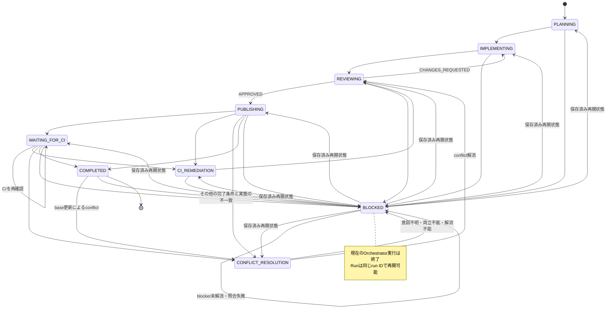

# 単一IssueのLoop Engineering契約

## 目的

Issue Agent Skillsが扱う単一のGitHub Issueについて、計画、実装、レビュー、publish、CI確認を、観測可能で停止・再開可能なループとして定義する。

本書はループの不変な設計契約の単一の正とする。Issueごとに変化する実行状態は、本書やrepository内のファイルではなく、対象GitHub Issueへ保存する。

## 対象範囲

```text
Issue
  -> Planner
  -> Implementer
  -> Reviewer
       -> CHANGES_REQUESTED -> Implementer
       -> APPROVED          -> publish
  -> required CI
       -> implementation failure -> Implementer -> Reviewer -> republish
       -> no observable progress -> WAITING_FOR_CI
       -> success                -> COMPLETED
```

対象は1件のIssueに対する1つのRunである。複数Issueの発見、優先順位付け、依存順実行、並列実行、継続スケジューリングは扱わない。

## 設計の正と実行状態

- 本書は状態、遷移、証跡、停止、再開、完了の設計を定義する。
- `.agents/skills/issue-orchestrator/SKILL.md`と`references/agent-interface.md`は、本書を実行可能なAgent契約へ具体化する。
- 対象Issueの専用状態コメントは、個別Runの現在状態を保持する。
- Issueタイムライン上のチェックポイントコメントは、重要な判断履歴を保持する。
- Git、GitHub、CIの実態は保存状態より優先する。再開時は両者を照合する。

設計と実行状態を同じrepository文書へ混在させない。実行状態をrepositoryへ保存すると、複数Issue間の編集競合、状態更新のためのcommit、古い状態の残存が発生するためである。

## Run識別子

OrchestratorはPlannerを開始する前に一意なrun IDを発行する。同じIssueを中断地点から再開するときは同じrun IDを使う。利用者が以前の状態を破棄して最初からやり直すことを明示した場合だけ、新しいrun IDを発行する。

run IDの再利用や新規発行を推測で決めない。既存Runと新しい実行が競合する場合は`BLOCKED`とする。

## 状態モデル

| 状態 | 意味 | Issueラベル |
| --- | --- | --- |
| `PLANNING` | Plannerが計画を作成中 | `status:in-progress` |
| `IMPLEMENTING` | Implementerが実装または修正中 | `status:in-progress` |
| `REVIEWING` | Reviewerが独立レビュー中 | `status:review` |
| `PUBLISHING` | レビュー済み変更をcommit、pushし、Draft PRを作成中 | `status:review` |
| `WAITING_FOR_CI` | 必須CIは継続中だが、Orchestratorは待機を終了済み | `status:review` |
| `CI_REMEDIATION` | 実装起因のCI失敗を修正中 | `status:in-progress` |
| `CONFLICT_RESOLUTION` | 競合する変更の意図を調査し、Issue branchのconflictを解消中 | `status:in-progress` |
| `COMPLETED` | Reviewer承認、Draft PR、必須CIの条件を満たした | `status:review` |
| `BLOCKED` | 人の判断、権限、外部状態変更、範囲外対応を待つ再開可能な停止状態 | `status:blocked` |

状態遷移は次に限定する。



`WAITING_FOR_CI`は失敗ではない。CIを継続させたまま現在のOrchestrator実行だけを終了し、同じIssueの明示的再実行を待つ状態である。

`BLOCKED`は現在のOrchestrator実行に対する終端状態だが、Run自体の終端状態ではない。`BLOCKED`からは、再開前の照合に成功した場合だけ、状態コメントに保存された再開状態へ同じrun IDで遷移する。新しい実行が別の状態を推測して選んではならない。

## 専用状態コメント

専用状態コメントは次のhidden markerを1つ含む。

```html
<!-- issue-agent-run-state:active:v1 -->
```

このmarkerは対象Issueで現行Runを指す唯一の非表示ポインタとする。AIは対象Issueのコメント一覧からmarkerを検索して状態コメントを特定する。人向けのIssue本文索引は必須としない。既存Runがあるのにmarker付きコメントが存在しない場合、または複数存在する場合は、投稿順や本文から現行Runを推測せず`BLOCKED`とする。

利用者が以前の状態を破棄して新しいRunを開始すると明示した場合は、旧Runの要約、破棄理由、旧run ID、新run IDをmarkerなしのチェックポイントコメントへ追記してから、同じ専用状態コメントを新Runの状態で更新する。過去Runのコメントへactive markerを残さない。

状態コメントには少なくとも次を記録する。

- run ID
- 開始時刻、最終更新時刻、終了時刻
- 現在状態、停止直前の状態、保存済みの再開状態、最後に検証済みのチェックポイント
- Planner、Implementer、Conflict Resolver、Reviewerと使用モデル
- 各AgentのOutcome
- レビュー差し戻し回数と指摘分類
- 実行したテストと成否
- Implementerの累積manifest
- Conflict Resolverのconflict-resolution manifest
- 外部変更の由来と範囲を記録するreconciliation manifest
- branch、commit、Draft PR、head SHA
- 必須CIと各checkの状態
- 停止理由または待機理由
- 再開地点と次に行う確認
- 人の介入回数
- 取得できる場合だけtoken数と費用

停止直前の状態はblockerを検知した状態を示す監査情報であり、再開時の遷移先には使用しない。保存済みの再開状態は、最後に検証済みのチェックポイントに基づく、次に着手すべき未完了の状態である。たとえば`IMPLEMENTING`の処理が完了した後、`REVIEWING`へ移るためのラベル更新で停止した場合、停止直前の状態は`IMPLEMENTING`、再開状態は`REVIEWING`とする。両者は一致してもよいが、再開時に一方から他方を推測してはならない。

会話全文、コマンド出力全文、CI生ログ、認証情報、token、秘密情報は保存しない。判断に必要な要約と、権限上安全な参照先だけを残す。

通常の細かな遷移は専用状態コメントの現在値として更新する。`BLOCKED`、再開、Reviewer承認、publish完了など、後から判断根拠になる重要なチェックポイントだけを新しいIssueコメントとして追記する。

## 停止条件

既定の停止条件は次とする。

1. Reviewerの差し戻しは最大3回とする。Issueに別の上限が明示されている場合だけ上書きする。
2. 修正を試みた後も、同じ指摘または同じテスト失敗が2回続いた場合は停止する。
3. manifest、テスト結果、指摘内容に実質的な進展がない状態が2周続いた場合は停止する。
4. 権限不足、安全性判断、Issue範囲外の変更、利用者の既存変更との競合が必要になった場合は直ちに停止する。
5. 保存状態とGit・GitHubの実態を安全に整合できない場合は停止する。

停止時は`BLOCKED`、停止条件、根拠、停止直前の状態、再開状態、最後に検証済みのチェックポイント、再開に必要な判断または外部変更を保存する。再開状態は、blockerが解消し、実態との照合に成功した後に次の処理を開始する状態とする。承認を推測したり、未解決の失敗を成功扱いしたりしない。

## 明示的な再開

Orchestratorはバックグラウンドで自動再開しない。利用者が同じIssueを再度`$issue-orchestrator`へ渡したときだけ再開する。

保存状態が`COMPLETED`の場合は、完了条件に関係するGit、GitHub、CIの実態を照合する。実態が保存状態と一致する場合は状態遷移や新しいrun IDの発行を行わず、完了済みとして報告する。通常のbase更新によるconflictだけが不一致である場合は、同じrun IDで`CONFLICT_RESOLUTION`へ遷移する。Draft PRのhead変更、未レビュー変更など、その他の不一致は同じrun IDのまま`BLOCKED`へ遷移し、不一致と再開に必要な対応を保存する。利用者が以前の状態を破棄して最初からやり直すことを明示した場合だけ、既存Runとは別の新しいrun IDを発行する。

再開前に次を実態から取得し、保存状態と照合する。

- 現在のbranchとworktree
- 開始前変更と累積manifest
- commitとremote branch
- Draft PRのbase、head、draft状態
- Issueの`status:*`ラベル
- 必須CIと対象head SHA

実態が保存状態と一致する場合、同じrun IDのまま、保存済みの再開状態へ遷移して最後に検証済みのチェックポイントから続行する。blockerが未解消の場合は`BLOCKED`を維持する。安全に説明できる変化だけがある場合は、根拠を状態へ記録してから整合する。未把握のcommit、未レビュー変更、manifest外変更、別Runとの競合がある場合は、状態を推測で上書きせず`BLOCKED`とする。

通常のbase更新によってIssue branchにconflictが発生した場合、OrchestratorはbaseをIssue branchへmergeして競合状態を準備する。Gitが未解決の競合ファイルを実際に生成した場合だけConflict Resolverを呼び出す。将来競合しそうなPRの予防的比較や、Gitが競合として検出しない意味上の不整合には呼び出さない。意味上の不整合はReviewerが指摘し、既存のImplementer修正ループで扱う。

Conflict Resolverの呼び出し後、Orchestratorはrebaseとforce-pushを行わない。Conflict Resolverはまず競合元commitに対応するPRを特定し、PR本文、差分、review、関連Issueから両側の意図を調査する。対応PRがない場合は関連Issueとcommit履歴まで調査する。取得した根拠と競合箇所を照合し、両側の意図を説明できる場合だけ、競合ファイルの編集と関連テストを行い、変更範囲と意図の根拠をconflict-resolution manifestとして返す。根拠が不足または矛盾する場合は推測で解消せず`BLOCKED`とする。

Conflict Resolverはmerge、rebase、commit、push、承認を行わない。解消後は`REVIEWING`へ遷移し、独立したReviewerが3つのmanifestの和集合を再レビューする。両側の意図が両立不能、または安全に解消できない場合も`BLOCKED`とする。

Conflict ResolverのOutcomeは`RESOLVED`と`BLOCKED`に限定する。`RESOLVED`は、意図の根拠、競合解消内容、conflict-resolution manifest、実行したテストと結果を伴う。`BLOCKED`は、判断できない意図、矛盾する根拠、両立不能な要件、または安全に解消できない理由と、続行に必要な判断を伴う。`APPROVED`と`CHANGES_REQUESTED`は独立したReviewerだけが返す。

Conflict Resolverが`RESOLVED`を返した後のレビュー修正は、指摘対象のmanifestにかかわらずImplementerへ渡す。Orchestratorは競合意図の根拠、3つのmanifest、テスト結果、Reviewerの指摘をImplementerへ引き継ぎ、Implementerによる追加変更を累積manifestへ記録する。Conflict Resolverを再起動しない。Reviewerが、修正可能な実装不備ではなく競合意図の根拠不足、矛盾、または両立不能を検出した場合は、Implementerに推測させず`BLOCKED`とする。

第三者がDraft PRのheadを直接変更して生じたconflictは自動解消しない。変更した第三者が解消し、再開前の照合で変更の由来と範囲を安全に説明できる場合は、その由来、範囲、該当commitをreconciliation manifestへ保存して`REVIEWING`へ再開する。外部変更をImplementerの累積manifestへ混在させない。説明できない場合は`BLOCKED`を維持する。

Runの同一性はAgent instanceやpane、sessionの同一性を要求しない。同一のOrchestrator実行内では修正前後を同じImplementerとReviewerへ戻す。`BLOCKED`によってその実行が終了した後は、保存済みの計画、Implementerの累積manifest、conflict-resolution manifest、reconciliation manifest、テスト結果、指摘、各AgentのOutcomeを引き継ぎ、同じ役割と指定モデルの新しいAgent instanceで再開できる。Reviewerを新しく起動した場合は、差分だけでなく3つのmanifestの和集合を再レビューさせる。指定モデルを利用できない場合は別モデルへ切り替えず、`BLOCKED`を維持する。

## CIフィードバックループ

Reviewerが`APPROVED`を返した変更だけをcommit、pushしてDraft PRを作成する。その後、対象head commitの必須CIを確認する。

- 必須CIがすべて成功した場合は`COMPLETED`とする。
- 必須CIが設定されていない場合は、その事実を証跡へ記録して`COMPLETED`にできる。
- 実装起因の失敗は`CI_REMEDIATION`として同じImplementerへ返す。
- 修正後は関連テスト、同じReviewerの再レビュー、レビュー済みmanifestだけのcommit、同じbranchへのpushを経て、新しいhead SHAのCIを確認する。
- flaky、GitHub Actions障害、外部サービス障害、原因不明、`cancelled`、`timed_out`、`action_required`は自動的に成功扱いまたは無制限再実行せず、証跡を保存して`BLOCKED`とする。

CI状態は30秒ごとに確認する。jobまたはstepの開始、完了、切替を観測可能な進捗とする。取得できる場合はログ末尾のハッシュ変化を補助に使えるが、ログ行数、ログ本文、`tail`だけに依存しない。

状態と補助ログの双方に5分間変化がなければ、CIを失敗またはキャンセルせず`WAITING_FOR_CI`として現在のOrchestrator実行を終了する。PR、head SHA、確認対象check、最後に観測した状態、再開地点を保存する。再開時は同じPRとhead SHAを実態から確認し、CI確認を続行する。

CIから実行中のCodexセッションを起動または再開する通知workflowは、本契約の対象外とする。

## 完了条件

Runは次をすべて満たした場合だけ`COMPLETED`とする。

- Reviewerが明示的に`APPROVED`を返している。
- PRの変更がImplementerの累積manifest、conflict-resolution manifest、reconciliation manifestのいずれかへ由来付きで記録され、Reviewerが3つのmanifestの和集合を確認している。
- default branch向けのDraft PRが作成されている。
- PRのhead SHAと確認対象CIのhead SHAが一致している。
- 必須CIがすべて成功しているか、必須CI未設定の事実が記録されている。
- 状態コメントと完了チェックポイントが更新されている。

Draft解除、PR承認、merge、branch削除、worktree cleanupは完了条件に含めない。

## 受入シナリオ

状態遷移の判定プログラムや自動シナリオテストは追加しない。通常のBootstrap `verify`では、次の入力と期待結果がSkill契約に反映されていることを読み取り専用で確認する。実動確認は明示的に承認されたlive verifyでのみ行い、実際に通過していない経路を検証済みと報告しない。

| シナリオ | 入力 | 期待結果 |
| --- | --- | --- |
| 正常完了 | Reviewer承認、Draft PR作成、必須CI成功 | `COMPLETED` |
| 必須CIなし | Reviewer承認、Draft PR作成、必須CI未設定 | 未設定を記録して`COMPLETED` |
| レビュー差し戻し | Reviewerが`CHANGES_REQUESTED` | 同じImplementerへ戻し、同じReviewerが再レビュー |
| 差し戻し上限 | 4回目の差し戻しが必要 | `BLOCKED` |
| 同一失敗反復 | 修正後も同じ指摘またはテスト失敗が2回継続 | `BLOCKED` |
| 無進展 | manifest、テスト、指摘に変化がない状態が2周継続 | `BLOCKED` |
| `BLOCKED`からの再開 | blockerが解消し、保存状態と実態が一致 | 同じrun IDで保存済みの再開状態へ遷移し、最後の検証済みチェックポイントから再開 |
| blocker未解消 | 明示的に再実行したが再開条件を満たさない | 同じrun IDで`BLOCKED`を維持 |
| 状態境界での停止 | `IMPLEMENTING`完了後、`REVIEWING`へ移るための操作で停止 | 停止直前の状態を`IMPLEMENTING`、再開状態を`REVIEWING`として保存 |
| Agent session終了後の再開 | 保存済みAgent instanceまたはpaneを再利用できない | 同じ役割と指定モデルの新しいAgentへ証跡を引き継ぐ。新しいReviewerは3つのmanifestの和集合を再レビュー |
| 完了済みIssueの再実行 | `COMPLETED`の保存状態と実態が一致 | 状態遷移と新しいrun ID発行を行わず、完了済みとして報告 |
| 完了後のbase conflict | 通常のbase更新によるconflictだけを検知 | 同じrun IDで`COMPLETED`から`CONFLICT_RESOLUTION`へ遷移 |
| 完了後のその他の不一致 | Draft PRのhead変更または未レビュー変更を検知 | 同じrun IDで`COMPLETED`から`BLOCKED`へ遷移し、不一致と必要な対応を保存 |
| 通常のbase conflict解消 | Conflict Resolverが競合する変更の意図を説明し、安全に両立できる | 競合ファイルを解消・テストし、conflict-resolution manifestを保存して`REVIEWING`へ遷移し、3つのmanifestの和集合を再レビュー |
| conflict解消後のレビュー修正 | Reviewerが解消後の変更に修正可能な実装不備を検出 | 競合意図の根拠と全manifestを引き継いでImplementerへ戻す |
| Reviewerが意図判断不能を検出 | 競合意図の根拠不足、矛盾、または両立不能 | Implementerに推測させず`BLOCKED` |
| 競合元PRなし | 競合元commitに対応するPRが存在しない | 関連Issueとcommit履歴から意図を調査し、十分な根拠がある場合だけ解消を続行 |
| 意図の根拠不足 | PR、Issue、commit履歴から意図を十分に説明できない、または根拠が矛盾 | 推測で解消せず`BLOCKED` |
| conflictの意図が不明 | 競合する意図が不明、両立不能、または安全に解消不能 | `BLOCKED` |
| 意味上の不整合 | Gitは競合を生成していないがReviewerが不整合を検出 | Conflict Resolverを呼ばず、既存のImplementer修正ループへ戻す |
| 第三者によるconflict解消後の再開 | 外部で解消された変更の由来と範囲を安全に説明できる | reconciliation manifestへ由来付きで保存し、同じrun IDで`REVIEWING`へ遷移して3つのmanifestの和集合を再レビュー |
| 第三者による解消内容が不明 | 外部変更の由来または範囲を説明できない | 追加のrebase、merge、force-pushを行わず`BLOCKED`を維持 |
| 状態不一致 | 未把握commitまたは未レビュー変更あり | 上書きせず`BLOCKED` |
| CI無変化 | job、step、補助ログが5分間無変化 | CIを継続させて`WAITING_FOR_CI` |
| CI実装失敗 | 実装起因の必須check失敗 | 同じImplementer、同じReviewerを経て再push・再確認 |
| CI外部失敗 | 外部障害または原因不明 | 証跡を保存して`BLOCKED` |

## 対象外

- 複数Issueの自動発見、選択、依存順実行、並列実行
- 定期実行またはバックグラウンドスケジューラ
- 状態遷移を判定するプログラム
- CI完了イベントによるCodexの自動起動
- GitHub Actions workflow自体の作成または変更
- 会話全文、コマンド出力全文、CI生ログの永続化
- PRのDraft解除、承認、merge

## 参考

- [What Is Loop Engineering?](https://www.ibm.com/think/topics/loop-engineering)
- [AI Harness Engineering: A Runtime Substrate for Foundation-Model Software Agents](https://arxiv.org/abs/2605.13357)
- [Agentic Harness Engineering: Observability-Driven Automatic Evolution of Coding-Agent Harnesses](https://arxiv.org/abs/2604.25850)
